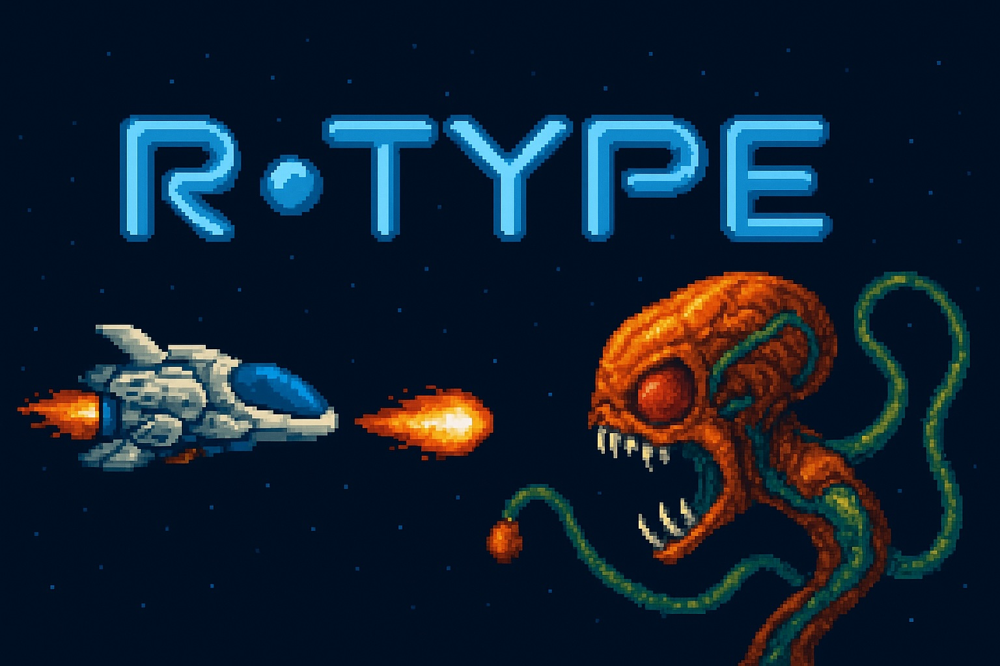

<div align="center">
    
</div>

<hr>

<div align="center" style="line-height=1">

[](https://github.com/azurioh/R-Type)
[](https://azuriohs-organization.gitbook.io/azurioh-r-type/)
[](https://github.com/Azurioh/R-Type/actions/workflows/epitech-mirroring.yml)

</div>

# Introduction

The goal of this project is to recreate network version of the classic arcade game R-Type using C++.

# Build

To build the project, you can use the provided `build.sh` script located in the `scripts` directory. The script takes two arguments: the action (`build` or `clean`) and the target directory (either `client` or `server`).

## Documentation

We use Doxygen to generate the documentation. To generate the documentation, you can go to the `client` or `server` directory and run the following command:

```bash
doxygen Doxyfile
```

## Contributing

For contributions guidelines, please refer to [this document](docs/contributing.md).

## Credits

- [Aymeric Bretin](https://github.com/AymericBretin)
- [Maël Bertocchi](https://github.com/mael-bertocchi)
- [Florian Peridy](https://github.com/Florianperidy)
- [Alan Cunin](https://github.com/Azurioh)
